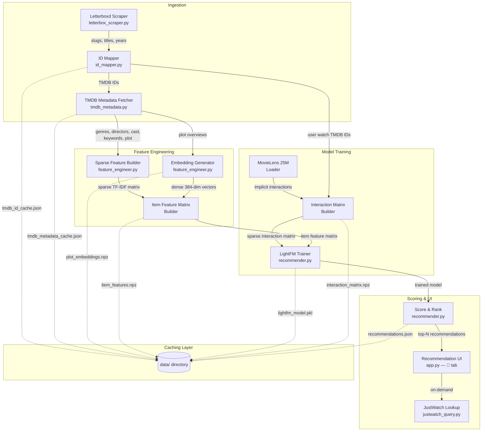
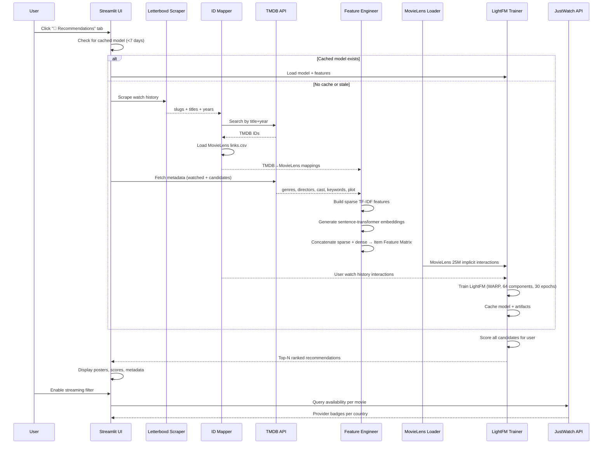

# Design Document: Hybrid Movie Recommender

## Overview

This design describes a hybrid movie recommendation engine that integrates into the existing Letterboxd watchlist streaming-availability app. The engine uses [LightFM](https://making.lyst.com/lightfm/docs/home.html), a hybrid matrix-factorization library that natively combines implicit collaborative-filtering signals (from MovieLens 25M) with rich item side features (sparse TF-IDF categorical features from TMDB metadata + dense 384-dim sentence-transformer plot embeddings).

The pipeline flows through five stages:

1. **Ingest** — Scrape the user's Letterboxd watch history and resolve each film to a TMDB ID.
2. **Enrich** — Fetch TMDB metadata (genres, directors, cast, keywords, plot overview) for watched films and candidate movies.
3. **Engineer** — Build the Item Feature Matrix: sparse TF-IDF vectors for categorical metadata concatenated with dense sentence-transformer plot embeddings.
4. **Train** — Construct the Interaction Matrix from MovieLens 25M + user watch history, then train a LightFM model with WARP loss and item side features.
5. **Score & Present** — Predict scores for all candidates, rank by descending score, and display in a new Streamlit "🎯 Recommendations" tab with optional JustWatch streaming availability.

All intermediate artifacts (TMDB metadata, embeddings, trained model, ID mappings) are cached locally in `data/` with a 7-day TTL to keep subsequent sessions fast.

### Key Design Decisions

| Decision | Rationale |
|---|---|
| LightFM with WARP loss | WARP optimizes top-of-list ranking for implicit feedback — exactly what we need for "recommend unseen movies". It natively accepts item side features, avoiding a separate content-based model. |
| MovieLens 25M as collaborative signal | Provides ~25M implicit interactions across ~62K movies, giving the model a strong collaborative prior even for a single user. |
| Sentence-transformer embeddings (all-MiniLM-L6-v2) | 384-dim embeddings capture thematic/plot similarity that categorical features miss. The model is small (~80MB), fast, and runs on CPU. |
| Sparse TF-IDF + dense embedding concatenation | LightFM accepts a single item-feature matrix. We horizontally stack the sparse categorical block with the dense embedding block (converted to sparse) so both signal types flow through the same factorization. |
| Local file caching (not DB) | The app is a single-user Streamlit tool. JSON/pickle/npz files in `data/` are simple, portable, and sufficient. |

## Architecture

### System Architecture Diagram



### Data Flow Sequence



## Components and Interfaces

### New Modules

| Module | Path | Responsibility |
|---|---|---|
| `id_mapper.py` | `src/id_mapper.py` | Maps Letterboxd slugs → TMDB IDs → MovieLens IDs. Loads MovieLens `links.csv`. Caches resolved TMDB IDs. |
| `tmdb_metadata.py` | `src/tmdb_metadata.py` | Fetches and caches TMDB metadata (genres, directors, cast, keywords, plot overview) for any set of TMDB IDs. Handles rate-limiting with exponential backoff. |
| `feature_engineer.py` | `src/feature_engineer.py` | Builds the Item Feature Matrix: sparse TF-IDF from categorical features + dense sentence-transformer embeddings. Handles feature pruning, concatenation, and caching. |
| `recommender.py` | `src/recommender.py` | Orchestrates the full pipeline: interaction matrix construction, LightFM training, scoring, ranking, serialization. Manages model caching and staleness checks. |

### Modified Modules

| Module | Change |
|---|---|
| `src/app.py` | Add a third tab "🎯 Recommendations" alongside existing Watchlist and Quick Lookup tabs. Import and call `recommender.py` functions. |

### Interface Definitions

#### `id_mapper.py`

```python
class IDMapper:
    def __init__(self, tmdb_token: str, cache_dir: Path):
        """Load MovieLens links.csv and TMDB ID cache."""

    def resolve_slug_to_tmdb_id(self, slug: str, title: str, year: int) -> int | None:
        """Resolve a Letterboxd slug to a TMDB ID via TMDB search. Caches results."""

    def tmdb_id_to_movielens_id(self, tmdb_id: int) -> int | None:
        """Look up MovieLens ID from TMDB ID using links.csv."""

    def movielens_id_to_tmdb_id(self, movielens_id: int) -> int | None:
        """Reverse lookup: MovieLens ID → TMDB ID."""

    def save_cache(self) -> None:
        """Persist the TMDB ID cache to disk."""
```

#### `tmdb_metadata.py`

```python
@dataclass
class MovieMetadata:
    tmdb_id: int
    title: str
    year: int
    genres: list[str]
    directors: list[str]
    cast: list[str]          # top 5 billed
    keywords: list[str]
    overview: str             # plot text
    poster_path: str | None
    runtime: int | None

class TMDBMetadataFetcher:
    def __init__(self, api_token: str, cache_path: Path):
        """Initialize with TMDB bearer token and cache file path."""

    def fetch_movie(self, tmdb_id: int) -> MovieMetadata | None:
        """Fetch full metadata for a single TMDB ID. Returns cached if available."""

    def fetch_batch(self, tmdb_ids: list[int], progress_callback=None) -> dict[int, MovieMetadata]:
        """Fetch metadata for a batch of TMDB IDs with rate-limit handling."""

    def fetch_candidates(self, genre_ids: list[int], min_pages: int = 250) -> list[MovieMetadata]:
        """Fetch candidate movies from TMDB discover endpoints (popular, top-rated, genre-based)."""

    def save_cache(self) -> None:
        """Persist metadata cache to disk."""
```

#### `feature_engineer.py`

```python
class FeatureEngineer:
    def __init__(self, cache_dir: Path, min_feature_count: int = 3):
        """Initialize with cache directory and feature pruning threshold."""

    def build_sparse_features(self, metadata: dict[int, MovieMetadata]) -> tuple[sp.csr_matrix, list[str]]:
        """Build TF-IDF weighted sparse feature matrix from categorical metadata.
        Returns (sparse_matrix, feature_names)."""

    def build_dense_embeddings(self, metadata: dict[int, MovieMetadata]) -> np.ndarray:
        """Generate 384-dim sentence-transformer embeddings for plot overviews.
        Returns (n_movies, 384) array. Zero vector for missing plots."""

    def build_item_feature_matrix(self, metadata: dict[int, MovieMetadata]) -> tuple[sp.csr_matrix, list[int]]:
        """Build the combined Item Feature Matrix (sparse TF-IDF ∥ dense embeddings).
        Returns (item_feature_matrix, tmdb_id_order)."""

    def save_cache(self) -> None:
        """Persist embeddings and feature matrix to disk."""
```

#### `recommender.py`

```python
@dataclass
class RecommendationResult:
    tmdb_id: int
    title: str
    year: int
    score: float              # normalized 0.0–1.0
    poster_url: str | None
    runtime: int | None
    genres: list[str]

class HybridRecommender:
    def __init__(self, config: dict, data_dir: Path):
        """Initialize with app config and data directory."""

    def is_model_fresh(self) -> bool:
        """Check if cached model exists and is less than 7 days old."""

    def train(self, watch_history: list[dict], progress_callback=None) -> None:
        """Full training pipeline: resolve IDs → fetch metadata → engineer features → train LightFM."""

    def recommend(self, n: int = 50) -> list[RecommendationResult]:
        """Score candidates and return top-N ranked recommendations."""

    def serialize_results(self, results: list[RecommendationResult], path: Path) -> None:
        """Serialize recommendation results to JSON."""

    def deserialize_results(self, path: Path) -> list[RecommendationResult]:
        """Deserialize recommendation results from JSON."""

    def retrain(self, watch_history: list[dict], progress_callback=None) -> None:
        """Force retrain regardless of cache freshness."""
```

### New Dependencies

| Package | Version | Purpose |
|---|---|---|
| `lightfm` | `>=1.17` | Hybrid matrix-factorization model with WARP loss |
| `sentence-transformers` | `>=2.2.0` | Generate 384-dim plot embeddings (all-MiniLM-L6-v2) |
| `scipy` | `>=1.11.0` | Sparse matrix operations (CSR matrices for LightFM) |
| `scikit-learn` | `>=1.3.0` | TF-IDF vectorization, min-max scaling |
| `numpy` | `>=1.24.0` | Array operations |

## Data Models

### Interaction Matrix

A sparse CSR matrix of shape `(n_users, n_items)` where:
- **Rows**: User indices. Row 0 through N-1 are MovieLens users. The final row (index N) is the Letterboxd user.
- **Columns**: Item indices corresponding to MovieLens movie IDs (internal 0-indexed).
- **Values**: 1 for any interaction (implicit feedback — all MovieLens ratings treated as positive, all user watched films treated as positive), 0 for no interaction.

```
interaction_matrix: scipy.sparse.csr_matrix
  shape: (~162,000 users, ~62,000 items)
  dtype: float32
  storage: data/interaction_matrix.npz
```

### Item Feature Matrix

A sparse CSR matrix of shape `(n_items, n_features)` where:
- **Rows**: Item indices (same ordering as Interaction Matrix columns).
- **Columns**: Feature indices. The first K columns are sparse TF-IDF features (genres, directors, cast, keywords). The next 384 columns are the dense sentence-transformer embedding dimensions.
- **Values**: TF-IDF weights for sparse features; raw embedding values for dense features.

```
item_feature_matrix: scipy.sparse.csr_matrix
  shape: (~62,000 items, K + 384 features)  # K ≈ 2,000–5,000 after pruning
  dtype: float32
  storage: data/item_features.npz
```

### Feature Construction Detail

```
Categorical features (per movie):
  genres:    ["Drama", "Thriller"]        → "genre:Drama", "genre:Thriller"
  directors: ["Denis Villeneuve"]         → "director:Denis Villeneuve"
  cast:      ["Timothée Chalamet", ...]   → "cast:Timothée Chalamet", ...
  keywords:  ["dystopia", "desert"]       → "keyword:dystopia", "keyword:desert"

TF-IDF weighting:
  - Each movie's categorical features are joined into a single text document
  - scikit-learn TfidfVectorizer with sublinear_tf=True, min_df=3
  - Features appearing in fewer than 3 movies are pruned

Dense embeddings (per movie):
  - sentence_transformers.SentenceTransformer("all-MiniLM-L6-v2")
  - Input: movie plot overview text (or empty string → zero vector)
  - Output: 384-dimensional float32 vector

Concatenation:
  - scipy.sparse.hstack([sparse_tfidf, sparse_embeddings])
  - Dense embeddings converted to CSR before stacking
```

### ID Mapping Tables

```
MovieLens links.csv:
  movieId (int) → tmdbId (int)
  ~62,000 entries

TMDB ID Cache (data/tmdb_id_cache.json):
  {
    "letterboxd_slug": tmdb_id,
    ...
  }
  Grows incrementally as new slugs are resolved.

Internal Index Mapping (in-memory, persisted in model pickle):
  tmdb_id_to_internal: dict[int, int]   # TMDB ID → 0-indexed item index
  internal_to_tmdb_id: dict[int, int]   # 0-indexed item index → TMDB ID
```

### Cached Artifacts

| Artifact | Path | Format | TTL |
|---|---|---|---|
| TMDB ID cache | `data/tmdb_id_cache.json` | JSON dict: slug → tmdb_id | Permanent (append-only) |
| TMDB metadata cache | `data/tmdb_metadata_cache.json` | JSON dict: tmdb_id → MovieMetadata fields | 7 days |
| Plot embeddings | `data/plot_embeddings.npz` | NumPy compressed: (n_movies, 384) float32 | 7 days |
| Item Feature Matrix | `data/item_features.npz` | SciPy sparse CSR | 7 days |
| Interaction Matrix | `data/interaction_matrix.npz` | SciPy sparse CSR | 7 days |
| Trained LightFM model | `data/lightfm_model.pkl` | Pickle (LightFM object + index maps) | 7 days |
| Recommendation results | `data/recommendations.json` | JSON list of RecommendationResult | Per-session |
| Candidate pool metadata | `data/candidate_pool.json` | JSON dict: tmdb_id → basic metadata | 7 days |
| MovieLens links | `data/ml-25m/links.csv` | CSV (downloaded once from GroupLens) | Permanent |

### Recommendation Result Schema

```json
{
  "tmdb_id": 550,
  "title": "Fight Club",
  "year": 1999,
  "score": 0.87,
  "poster_url": "https://image.tmdb.org/t/p/w500/pB8BM7pdSp6B6Ih7QZ4DrQ3PmJK.jpg",
  "runtime": 139,
  "genres": ["Drama", "Thriller"]
}
```

### Item Feature Matrix Metadata Schema

```json
{
  "n_items": 62000,
  "n_sparse_features": 3200,
  "n_dense_features": 384,
  "total_features": 3584,
  "sparsity": 0.997,
  "min_df_threshold": 3,
  "feature_names_sample": ["genre:Drama", "genre:Comedy", "director:Martin Scorsese", "cast:Robert De Niro", "keyword:love"],
  "created_at": "2025-01-15T10:30:00Z"
}
```


## Correctness Properties

*A property is a characteristic or behavior that should hold true across all valid executions of a system — essentially, a formal statement about what the system should do. Properties serve as the bridge between human-readable specifications and machine-verifiable correctness guarantees.*

### Property 1: TMDB ID Cache Round-Trip

*For any* set of Letterboxd slug → TMDB ID mappings, serializing the cache to JSON and then deserializing it SHALL produce an equivalent mapping where every slug resolves to the same TMDB ID.

**Validates: Requirements 1.4**

### Property 2: User Interactions in Interaction Matrix

*For any* set of watched TMDB IDs (mapped to valid internal item indices), inserting them as the user's row in the Interaction Matrix SHALL result in the user row having value 1 at exactly those item indices and 0 elsewhere.

**Validates: Requirements 1.5, 5.2**

### Property 3: TMDB Metadata Cache Round-Trip

*For any* set of MovieMetadata objects, serializing them to the JSON cache and then deserializing SHALL produce objects with equivalent field values (tmdb_id, title, year, genres, directors, cast, keywords, overview, poster_path, runtime).

**Validates: Requirements 2.2**

### Property 4: Sparse TF-IDF Feature Construction Invariants

*For any* set of MovieMetadata objects (with at least 3 movies), the resulting sparse TF-IDF feature matrix SHALL have exactly one row per movie, all non-negative values, and every feature column SHALL have non-zero entries in at least `min_df` (3) movies.

**Validates: Requirements 3.1, 3.2, 3.3**

### Property 5: Feature Label Reconstruction

*For any* movie in the feature matrix, the set of non-zero feature labels for that movie SHALL be a subset of the movie's original categorical metadata labels (genre:X, director:X, cast:X, keyword:X), accounting for features pruned by the min_df threshold.

**Validates: Requirements 3.4**

### Property 6: Embedding Dimensionality and Zero-Vector Invariant

*For any* set of movies with plot overviews (including empty/missing overviews), the generated embedding matrix SHALL have shape (n_movies, 384) with dtype float32, and movies with empty or missing plot overviews SHALL have all-zero embedding vectors.

**Validates: Requirements 4.1, 4.2**

### Property 7: Embedding Cache Round-Trip

*For any* embedding matrix of shape (n, 384), saving to NPZ format and reloading SHALL produce a numerically equivalent matrix (within float32 precision).

**Validates: Requirements 4.3**

### Property 8: Item Feature Matrix Concatenation Shape

*For any* set of movies with K sparse TF-IDF features and 384-dim dense embeddings, the concatenated Item Feature Matrix SHALL have shape (n_movies, K + 384), and slicing the first K columns SHALL recover the sparse TF-IDF block while slicing the last 384 columns SHALL recover the dense embedding block.

**Validates: Requirements 4.4**

### Property 9: Implicit Feedback Binarization

*For any* set of MovieLens rating entries (with ratings 0.5–5.0), converting to implicit feedback SHALL produce a matrix where every non-zero entry is exactly 1.0.

**Validates: Requirements 5.1**

### Property 10: Model Serialization Round-Trip

*For any* trained LightFM model, saving to pickle and reloading SHALL produce a model that generates identical prediction scores for the same user-item pairs.

**Validates: Requirements 5.4**

### Property 11: Score Normalization, Ranking, and Coverage

*For any* set of raw prediction scores for N candidate movies, the normalized scores SHALL all be in the range [0.0, 1.0], the minimum normalized score SHALL be 0.0, the maximum SHALL be 1.0, the returned list SHALL be sorted in descending order by score, and the number of results SHALL equal min(N, requested_top_n).

**Validates: Requirements 6.1, 6.2, 6.3**

### Property 12: Watch History Exclusion from Results

*For any* set of candidate movies and any watch history, the ranked recommendation results SHALL contain no movie whose TMDB ID appears in the watch history set.

**Validates: Requirements 6.4, 7.3**

### Property 13: ID Mapping Round-Trip

*For any* TMDB ID present in the MovieLens links data, mapping from TMDB ID to MovieLens ID and then back to TMDB ID SHALL return the original TMDB ID.

**Validates: Requirements 8.5**

### Property 14: Recommendation Result Serialization Round-Trip

*For any* valid RecommendationResult object (with tmdb_id, title, year, score in [0,1], optional poster_url, optional runtime, and genre list), serializing to JSON and then deserializing SHALL produce an object with equivalent field values.

**Validates: Requirements 11.1, 11.2, 11.3**

### Property 15: Feature Matrix Metadata Serialization Round-Trip

*For any* Item Feature Matrix metadata object (n_items, n_sparse_features, n_dense_features, total_features, sparsity, min_df_threshold, feature_names_sample, created_at), serializing to JSON and then deserializing SHALL produce an object with equivalent field values.

**Validates: Requirements 11.4**

## Error Handling

### TMDB API Errors

| Error | Handling |
|---|---|
| HTTP 429 (rate limit) | Exponential backoff: 1s, 2s, 4s. Max 3 retries. Skip film after exhaustion. |
| HTTP 404 (not found) | Log warning, return `None`. Film excluded from pipeline. |
| Network timeout | 15s timeout per request. Retry once, then skip. |
| Invalid/empty response | Log warning, return `None`. Film excluded. |

### Letterboxd Scraping Errors

| Error | Handling |
|---|---|
| Page load failure | Retry once with fresh page. Log warning and continue with partial results. |
| No films found | Return empty list. UI displays "No watch history found" message. |
| Cloudflare block | Fall back to `cloudscraper` if Playwright fails. |

### MovieLens Data Errors

| Error | Handling |
|---|---|
| `links.csv` not found | Download from GroupLens on first run. If download fails, raise clear error with instructions. |
| Corrupt CSV | Log error, attempt re-download. |
| Missing TMDB ID in links | Return `None` for that mapping. Film excluded from collaborative signal but still gets content-based features. |

### Model Training Errors

| Error | Handling |
|---|---|
| Insufficient interactions | If user has < 10 resolvable films, warn user and fall back to content-only ranking (cosine similarity on item features). |
| LightFM convergence failure | Catch exception, log error, retry with reduced components (32) and epochs (15). |
| Out of memory | Catch `MemoryError`, suggest reducing candidate pool size in config. |

### Embedding Generation Errors

| Error | Handling |
|---|---|
| Model download failure | Retry once. If fails, fall back to zero vectors for all plots (sparse-only features). |
| GPU/CPU incompatibility | Force CPU mode via `device="cpu"` parameter. |
| Empty plot text | Use zero vector of 384 dimensions (by design, not an error). |

### Caching Errors

| Error | Handling |
|---|---|
| Corrupt cache file | Log warning, delete corrupt file, recompute from scratch. |
| Disk full | Catch `OSError`, warn user, continue without caching. |
| Permission error | Catch `PermissionError`, warn user, continue with in-memory only. |

### UI Error States

| Scenario | User-Facing Message |
|---|---|
| No watch history | "No Letterboxd watch history found. Make sure your profile is public." |
| < 10 resolvable films | "Only {n} films could be matched. Recommendations may be less accurate." |
| Model training in progress | Progress bar with "Training recommendation model... This may take a few minutes on first run." |
| Stale cache being refreshed | "Refreshing recommendation data..." with spinner. |
| JustWatch lookup failure | "Streaming availability unavailable" badge instead of provider list. |

## Testing Strategy

### Property-Based Testing

This feature is well-suited for property-based testing because it involves:
- Pure data transformations (TF-IDF construction, score normalization, ID mapping)
- Serialization round-trips (JSON caches, NumPy arrays, pickle models)
- Matrix invariants (shape, value ranges, sparsity constraints)
- Filtering invariants (watch history exclusion)

**Library**: [Hypothesis](https://hypothesis.readthedocs.io/) for Python property-based testing.

**Configuration**:
- Minimum 100 examples per property test (`@settings(max_examples=100)`)
- Each test tagged with a comment referencing the design property
- Tag format: `# Feature: hybrid-movie-recommender, Property {N}: {title}`

**Property Test Mapping**:

| Property | Test Module | What Varies |
|---|---|---|
| 1: TMDB ID Cache Round-Trip | `test_id_mapper.py` | Random slug strings, random TMDB IDs |
| 2: User Interactions in Matrix | `test_recommender.py` | Random sets of item indices, matrix sizes |
| 3: TMDB Metadata Cache Round-Trip | `test_tmdb_metadata.py` | Random MovieMetadata field values |
| 4: Sparse TF-IDF Invariants | `test_feature_engineer.py` | Random genre/director/cast/keyword lists |
| 5: Feature Label Reconstruction | `test_feature_engineer.py` | Random categorical metadata |
| 6: Embedding Dimensionality | `test_feature_engineer.py` | Random plot text strings (including empty) |
| 7: Embedding Cache Round-Trip | `test_feature_engineer.py` | Random float32 arrays of shape (n, 384) |
| 8: Concatenation Shape | `test_feature_engineer.py` | Random sparse + dense matrix pairs |
| 9: Implicit Feedback Binarization | `test_recommender.py` | Random rating values (0.5–5.0) |
| 10: Model Serialization Round-Trip | `test_recommender.py` | Small synthetic training data |
| 11: Score Normalization & Ranking | `test_recommender.py` | Random float score arrays |
| 12: Watch History Exclusion | `test_recommender.py` | Random candidate sets and watch histories |
| 13: ID Mapping Round-Trip | `test_id_mapper.py` | Random bidirectional ID mappings |
| 14: Result Serialization Round-Trip | `test_recommender.py` | Random RecommendationResult objects |
| 15: Metadata Serialization Round-Trip | `test_feature_engineer.py` | Random feature matrix metadata |

### Unit Tests (Example-Based)

Unit tests complement property tests by covering specific scenarios, edge cases, and integration points:

| Test | Module | What's Verified |
|---|---|---|
| Unresolvable film handling | `test_id_mapper.py` | Film with no TMDB match is excluded, warning logged (Req 1.3) |
| TMDB retry on 429 | `test_tmdb_metadata.py` | 3 retries with backoff, then skip (Req 2.3) |
| Model staleness check | `test_recommender.py` | Model <7 days → load; ≥7 days → retrain (Req 5.5) |
| Watch history change detection | `test_recommender.py` | Changed history triggers retrain (Req 5.6) |
| Model hyperparameters | `test_recommender.py` | no_components ≥ 64, epochs ≥ 30 (Req 5.7) |
| Small candidate pool warning | `test_recommender.py` | Pool < 1,000 → warning logged (Req 7.5) |
| Candidate pool cache staleness | `test_recommender.py` | Cache <7 days → reuse (Req 7.4) |
| Links.csv loading | `test_id_mapper.py` | Non-empty mapping dict after load (Req 8.1) |
| Missing MovieLens ID returns None | `test_id_mapper.py` | Unknown TMDB ID → None (Req 8.4) |

### Integration Tests

| Test | What's Verified |
|---|---|
| End-to-end pipeline (small scale) | Scrape 5 films → resolve IDs → fetch metadata → build features → train → score → rank. Verify output is a sorted list of RecommendationResult objects. |
| TMDB discovery endpoint | Verify discovery returns movies with expected metadata fields. |
| JustWatch streaming lookup | Verify provider badges render for a known movie. |
| Streamlit tab rendering | Verify "🎯 Recommendations" tab exists alongside existing tabs. |

### Test Dependencies

```
pytest>=7.0
hypothesis>=6.0
pytest-mock>=3.0
```
