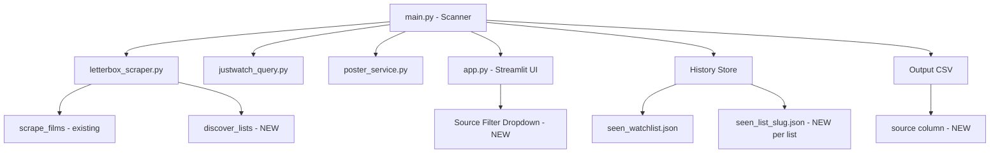

# Design Document: Personal Lists Support

## Overview

This feature extends the letterboxd-justwatch-vpn tool from a single-source (watchlist-only) scanner to a multi-source scanner that automatically discovers and processes all of a user's personal Letterboxd lists. The core idea is to scrape the user's profile lists page to find all list URLs, then iterate over each list (plus the watchlist) using the existing `scrape_films()` function, deduplicate films, query streaming availability, and present results with per-source tagging in both the CSV output and the Streamlit UI.

The design preserves backward compatibility: the existing watchlist flow, history file, and CSV format continue to work. New capabilities are additive.

## Architecture



### Key Design Decisions

1. **Reuse `scrape_films()` as-is.** The existing function already handles any paginated Letterboxd URL. No changes needed — we just call it with each discovered list URL.

2. **New `discover_lists()` function in `letterbox_scraper.py`.** Scrapes the user's `/lists/` page to extract list names and URLs. Uses the same `cloudscraper` session and pagination logic.

3. **Per-source history files.** Each source gets its own `seen_<key>.json` file. The watchlist keeps `seen_watchlist.json` for backward compatibility. Personal lists use `seen_list_<slug>.json`.

4. **Deduplication before JustWatch queries.** Films appearing in multiple lists are queried once. The `source` column in the CSV stores a comma-separated list of all source names for that film.

5. **Additive CSV column.** A `source` column is appended to the CSV. The Streamlit app gracefully handles its absence for backward compatibility.

## Components and Interfaces

### 1. `letterbox_scraper.py` — New Function

```python
def discover_lists(username: str, sleep: float = 1, max_pages: int = 10) -> list[dict]:
    """
    Scrape the user's Letterboxd lists page to discover all personal lists.
    
    Args:
        username: Letterboxd username
        sleep: Delay between page requests
        max_pages: Maximum pages to paginate through
    
    Returns:
        List of dicts with keys: 'name' (str), 'url' (str), 'slug' (str)
        Example: [{'name': 'Top 50 Sci-Fi', 'url': '/bucanero2010/list/top-50-sci-fi/', 'slug': 'top-50-sci-fi'}]
    """
```

This function:
- Fetches `https://letterboxd.com/{username}/lists/` with pagination
- Parses list entries from the HTML (each list links to `/username/list/slug/`)
- Extracts the list name and slug from the page structure
- Returns a list of dicts, one per discovered list

### 2. `main.py` — Scanner Orchestration Changes

The `main()` function is restructured to:

1. **Discover sources**: Call `discover_lists(USERNAME)` to get personal lists. Build a sources list:
   ```python
   sources = [
       {'name': 'Watchlist', 'url': f'/{USERNAME}/watchlist/', 'key': 'watchlist'},
       # + one entry per discovered list
       {'name': list_name, 'url': list_url, 'key': f'list_{slug}'},
   ]
   ```

2. **Per-source loop**: For each source, load its history, determine full-scan vs daily-scan, scrape films, and save history.

3. **Deduplicate**: Merge all films across sources. Track which sources each film belongs to using a `dict[film_id, set[source_name]]` mapping.

4. **Query JustWatch**: Query only unique films (no duplicates across sources).

5. **Build output**: Add a `source` column to each CSV row, containing comma-separated source names.

6. **Prune**: Remove rows where the film no longer appears in any current source.

#### New Helper Functions in `main.py`

```python
def get_history_path(source_key: str) -> Path:
    """Return the history file path for a given source key."""
    return DATA_DIR / f"seen_{source_key}.json"

def load_history(source_key: str) -> set:
    """Load history for a specific source."""
    path = get_history_path(source_key)
    if path.exists():
        with open(path, "r") as f:
            return set(json.load(f))
    return set()

def save_history(source_key: str, history_set: set):
    """Save history for a specific source."""
    path = get_history_path(source_key)
    with open(path, "w") as f:
        json.dump(list(history_set), f)
```

### 3. `app.py` — Streamlit UI Changes

- Check if `source` column exists in the DataFrame
- If present, add a source filter dropdown in the sidebar with "📋 All sources" default + one option per distinct source value
- Filter the DataFrame based on selection
- When "All sources" is selected, deduplicate by title+year for the grid display
- If `source` column is absent, skip the filter (backward compatibility)

## Data Models

### Source Descriptor

```python
# Used internally in main.py to represent a scan source
source = {
    'name': str,   # Human-readable name, e.g. "Watchlist" or "Top 50 Sci-Fi"
    'url': str,     # Letterboxd path, e.g. "/bucanero2010/watchlist/"
    'key': str,     # File-safe key, e.g. "watchlist" or "list_top-50-sci-fi"
}
```

### Film with Source Tracking

```python
# Extended film dict used during scanning
film = {
    'title': str,
    'year': int | None,
    'slug': str,
    'sources': set[str],  # Set of source names this film belongs to
}
```

### History File (per source)

- Path: `data/seen_<source_key>.json`
- Format: JSON array of `"title_year"` strings (same as existing `seen_watchlist.json`)
- Example: `data/seen_list_top-50-sci-fi.json`

### CSV Output (extended)

| Column | Type | Description |
|--------|------|-------------|
| title | str | Film title |
| year | int | Release year |
| country | str | Country code |
| provider | str | Streaming provider name |
| poster_url | str | TMDB poster URL |
| runtime | int/null | Runtime in minutes |
| last_updated | str | Date of last scan |
| source | str | **NEW** — Comma-separated source names (e.g. "Watchlist, Top 50 Sci-Fi") |

### Discovered List Entry (from `discover_lists`)

```python
{
    'name': str,   # Display name from the lists page, e.g. "Top 50 Sci-Fi"
    'url': str,    # Relative URL path, e.g. "/bucanero2010/list/top-50-sci-fi/"
    'slug': str,   # URL slug, e.g. "top-50-sci-fi"
}
```


## Correctness Properties

*A property is a characteristic or behavior that should hold true across all valid executions of a system — essentially, a formal statement about what the system should do. Properties serve as the bridge between human-readable specifications and machine-verifiable correctness guarantees.*

### Property 1: History path derivation

*For any* valid source key string, `get_history_path(source_key)` SHALL return a path equal to `DATA_DIR / f"seen_{source_key}.json"`. In particular, `get_history_path("watchlist")` returns `seen_watchlist.json` and `get_history_path("list_<slug>")` returns `seen_list_<slug>.json`.

**Validates: Requirements 2.1, 2.2, 2.3**

### Property 2: Deduplication preserves all unique films

*For any* collection of film lists (each containing films with title and year), after deduplication by (title, year), the resulting set SHALL contain exactly one entry per unique (title, year) pair, and the set of unique (title, year) pairs in the output SHALL equal the union of unique (title, year) pairs across all input lists.

**Validates: Requirements 3.2, 4.1**

### Property 3: Multi-source tagging correctness

*For any* film that appears in N sources (N ≥ 1), the `source` field for that film in the output SHALL contain exactly the set of source names where that film appears — no more, no less.

**Validates: Requirements 3.5**

### Property 4: Pruning removes only stale films

*For any* existing CSV DataFrame and any current combined film ID set, after pruning: (a) every remaining row's film ID SHALL be in the current set, and (b) no row whose film ID is in the current set SHALL have been removed.

**Validates: Requirements 4.2, 4.3**

### Property 5: Source filter returns matching rows

*For any* DataFrame with a `source` column and any selected source name, filtering by that source SHALL return only rows where the `source` column contains the selected source name, and SHALL return all such rows.

**Validates: Requirements 5.3**

### Property 6: "All sources" deduplicates by title and year

*For any* DataFrame with a `source` column, when "All sources" is selected, the displayed result SHALL contain at most one entry per unique (title, year) pair, and every unique (title, year) pair present in the DataFrame SHALL appear in the result.

**Validates: Requirements 5.4**

## Error Handling

| Scenario | Behavior |
|----------|----------|
| Lists page unreachable / HTTP error | Log warning, continue with watchlist only |
| Lists page returns no lists | Log info message, continue with watchlist only |
| Individual list URL fails to scrape | Log warning for that list, continue with remaining sources |
| History file missing or corrupt JSON | Treat as empty history (full scan for that source) |
| History file write failure | Log error, continue (scan results still written to CSV) |
| CSV missing `source` column (old format) | Streamlit skips source filter, displays all rows |
| Film has no year | Use `title_None` as film ID (consistent with existing behavior) |

All errors are handled gracefully with logging — no source failure should halt the entire pipeline. The principle is: degrade to fewer sources rather than crash.

## Testing Strategy

### Unit Tests (example-based)

- **List discovery parsing**: Mock HTML responses for the lists page, verify correct extraction of list names, URLs, and slugs (Req 1.1, 1.2)
- **Empty lists page**: Verify info log and watchlist-only processing (Req 1.5)
- **Unreachable lists page**: Verify warning log and graceful fallback (Req 1.6)
- **History file backward compatibility**: Verify `seen_watchlist.json` is used for the watchlist source (Req 2.2)
- **History retention**: Verify history files are not deleted when a list disappears (Req 2.5)
- **CSV source column presence**: Verify output CSV contains the `source` column (Req 3.4)
- **Streamlit backward compatibility**: Verify no source filter when `source` column is absent (Req 5.5)
- **Streamlit default selection**: Verify "All sources" is the default (Req 5.2)

### Property-Based Tests

Property-based tests use `hypothesis` (Python PBT library). Each test runs a minimum of 100 iterations.

| Test | Property | Tag |
|------|----------|-----|
| `test_history_path_derivation` | Property 1 | Feature: personal-lists-support, Property 1: History path derivation |
| `test_deduplication_preserves_unique_films` | Property 2 | Feature: personal-lists-support, Property 2: Deduplication preserves all unique films |
| `test_multi_source_tagging` | Property 3 | Feature: personal-lists-support, Property 3: Multi-source tagging correctness |
| `test_pruning_removes_only_stale_films` | Property 4 | Feature: personal-lists-support, Property 4: Pruning removes only stale films |
| `test_source_filter_returns_matching_rows` | Property 5 | Feature: personal-lists-support, Property 5: Source filter returns matching rows |
| `test_all_sources_deduplicates` | Property 6 | Feature: personal-lists-support, Property 6: All sources deduplicates by title and year |

### Integration Tests

- **End-to-end multi-source scan**: Mock Letterboxd responses for lists page + 2 personal lists + watchlist. Verify the output CSV contains films from all sources with correct `source` tags.
- **Pruning after list deletion**: Run a scan with 2 lists, then run again with 1 list removed. Verify exclusive films from the removed list are pruned.
- **Per-source history independence**: Run scans for multiple sources, verify each source's history file is written independently and contains only that source's film IDs.
