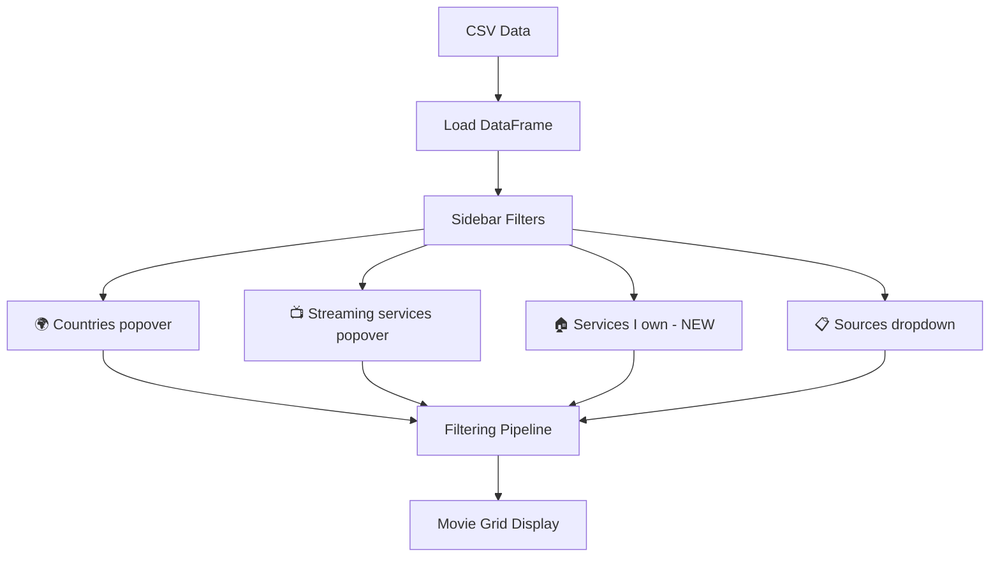
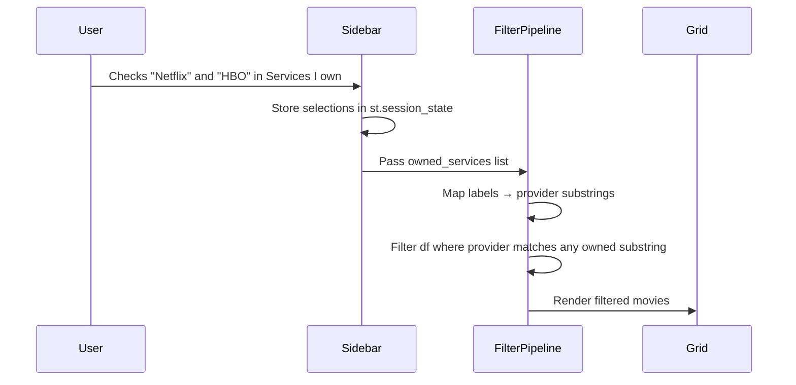

# Design Document: Services I Own Filter

## Overview

Add a "Services I own" checkbox filter to the Streamlit sidebar that lets the user mark which streaming services they subscribe to from a predefined list: Netflix, Prime, HBO, Apple, Disney, Youtube, RTVE. When one or more services are checked, the movie grid filters to only show movies available on those owned services. This is distinct from the existing "Streaming services" popover, which shows all providers found in the data — the new filter is a curated personal shortcut.

The change is scoped entirely to `src/app.py`. A mapping dictionary translates the short checkbox labels (e.g., "Prime") to substrings that match the `provider` column in the CSV (e.g., "Amazon Prime Video", "Amazon Prime Video Free"). The filter is applied as an additional AND condition on the existing filtering pipeline, between the existing services filter and the source filter.

## Architecture



## Sequence Diagram



## Components and Interfaces

### Component: Owned Services Mapping

**Purpose**: Translate short user-facing checkbox labels to substrings that match the `provider` column values in the CSV.

```python
OWNED_SERVICES_MAP: dict[str, list[str]] = {
    "Netflix":  ["Netflix"],
    "Prime":    ["Amazon Prime Video"],
    "HBO":      ["HBO Max"],
    "Apple":    ["Apple TV"],
    "Disney":   ["Disney Plus"],
    "Youtube":  ["YouTube"],
    "RTVE":     ["RTVE"],
}
```

**Design decisions**:
- Substring matching (`provider.contains(...)`) is used instead of exact equality so that variants like "Amazon Prime Video Free", "YouTube Free", "YouTube TV" are all captured by a single entry.
- The map is a module-level constant — easy to extend if the user adds more services later.

### Component: Sidebar UI (Services I own popover)

**Purpose**: Render a popover with checkboxes for each predefined service, plus a "Select all" toggle.

**Interface**: Follows the same `toggle_all` + `st.session_state` pattern already used by the Countries and Streaming services popovers.

```python
# Session state keys:
#   "all_owned"          → bool (select-all toggle)
#   "owned_{label}"      → bool per service (e.g., "owned_Netflix")
```

**Responsibilities**:
- Initialize session state keys on first run (all unchecked by default — opt-in model)
- Render "Select all" checkbox wired to `toggle_all` callback
- Render one checkbox per service in `OWNED_SERVICES_MAP`
- Expose `selected_owned_services: list[str]` (list of checked labels)

### Component: Filter Logic

**Purpose**: Apply the owned-services filter as an additional AND condition in the filtering pipeline.

**Responsibilities**:
- Only apply when at least one owned service is checked (empty selection = no filtering, pass-through)
- Build a boolean mask using substring matching against the provider column
- Combine with existing country + streaming service filters

## Data Models

### Owned Services Map

```python
# Key:   short label shown in the UI checkbox
# Value: list of substrings to match against df["provider"]
OWNED_SERVICES_MAP: dict[str, list[str]] = {
    "Netflix":  ["Netflix"],
    "Prime":    ["Amazon Prime Video"],
    "HBO":      ["HBO Max"],
    "Apple":    ["Apple TV"],
    "Disney":   ["Disney Plus"],
    "Youtube":  ["YouTube"],
    "RTVE":     ["RTVE"],
}
```

**Validation rules**:
- Every key must be a non-empty string (the checkbox label)
- Every value must be a non-empty list of non-empty strings (provider substrings)
- Substring matching is case-sensitive (provider names in CSV are already properly cased)

## Key Functions with Formal Specifications

### Function: matches_owned_service

```python
def matches_owned_service(provider: str, owned_labels: list[str]) -> bool:
    """Return True if provider matches any substring from the selected owned services."""
```

**Preconditions:**
- `provider` is a non-null string (from `df["provider"]`)
- `owned_labels` is a list of keys from `OWNED_SERVICES_MAP`

**Postconditions:**
- Returns `True` if any substring in the union of `OWNED_SERVICES_MAP[label]` for each label in `owned_labels` is found within `provider`
- Returns `False` otherwise
- No side effects

**Note**: In practice this is implemented inline as a pandas boolean mask rather than a standalone function, but the logic is equivalent.

### Function: build_owned_mask

```python
def build_owned_mask(df: pd.DataFrame, owned_labels: list[str]) -> pd.Series:
    """Build a boolean Series mask for rows whose provider matches any owned service."""
```

**Preconditions:**
- `df` has a `"provider"` column of type `str`
- `owned_labels` is a non-empty list of valid keys from `OWNED_SERVICES_MAP`

**Postconditions:**
- Returns a `pd.Series` of `bool` with same index as `df`
- `mask[i] == True` iff `df["provider"][i]` contains at least one substring from the union of all `OWNED_SERVICES_MAP[label]` for `label` in `owned_labels`

**Loop invariant**: For each label processed, the mask accumulates via OR — previously matched rows stay matched.

## Algorithmic Pseudocode

### Owned-Service Filtering Algorithm

```python
# 1. Collect selected owned labels from session state
selected_owned = [
    label for label in OWNED_SERVICES_MAP
    if st.session_state.get(f"owned_{label}", False)
]

# 2. Only filter if user has checked at least one service
if selected_owned:
    # 3. Flatten all substrings for selected labels
    patterns = []
    for label in selected_owned:
        patterns.extend(OWNED_SERVICES_MAP[label])

    # 4. Build OR mask: row matches if provider contains ANY pattern
    mask = pd.Series(False, index=filtered_df.index)
    for pattern in patterns:
        mask = mask | filtered_df["provider"].str.contains(pattern, regex=False)

    # 5. Apply mask
    filtered_df = filtered_df[mask]
```

**Preconditions:**
- `filtered_df` already has country and streaming-service filters applied
- `OWNED_SERVICES_MAP` is defined and non-empty

**Postconditions:**
- If no owned services are checked, `filtered_df` is unchanged (pass-through)
- If owned services are checked, `filtered_df` only contains rows where `provider` matches at least one selected service's substrings

**Loop invariant (pattern loop):**
- After processing pattern `i`, `mask` is `True` for all rows matching patterns `0..i`

## Example Usage

```python
# User checks "Netflix" and "HBO" in the sidebar
# Session state: owned_Netflix=True, owned_HBO=True, all others False

selected_owned = ["Netflix", "HBO"]
patterns = ["Netflix", "HBO Max"]  # flattened from map

# Given a filtered_df with providers:
#   ["Netflix", "Filmin", "HBO Max", "Amazon Prime Video", "Netflix"]
# The mask becomes:
#   [True, False, True, False, True]
# Result: only Netflix and HBO Max rows survive
```

## Correctness Properties

*A property is a characteristic or behavior that should hold true across all valid executions of a system — essentially, a formal statement about what the system should do. Properties serve as the bridge between human-readable specifications and machine-verifiable correctness guarantees.*

### Property 1: Map structure validity

*For any* key in the Owned_Services_Map, the corresponding value SHALL be a non-empty list where every element is a non-empty string.

**Validates: Requirement 1.2**

### Property 2: Toggle all sets all checkboxes

*For any* initial combination of checked/unchecked service checkboxes and any boolean value V, setting the Select_All_Toggle to V SHALL result in every individual service checkbox being set to V.

**Validates: Requirements 3.1, 3.2**

### Property 3: Pass-through when no services selected

*For any* DataFrame with a provider column, if no owned service checkboxes are checked, the filter SHALL return a DataFrame identical to the input.

**Validates: Requirement 4.1**

### Property 4: Subset guarantee

*For any* DataFrame and any non-empty selection of owned services, every row in the filtered output SHALL have a provider value that contains at least one substring from the selected services' Owned_Services_Map entries.

**Validates: Requirement 4.2**

### Property 5: No false exclusions

*For any* DataFrame and any non-empty selection of owned services, every row in the input whose provider contains a matching substring from the selected services SHALL appear in the filtered output.

**Validates: Requirements 4.3, 5.1, 5.3**

### Property 6: Check-uncheck round-trip

*For any* DataFrame and any single owned service, filtering with that service checked and then filtering with it unchecked SHALL produce the same result as the original unfiltered DataFrame.

**Validates: Requirement 7.3**

## Error Handling

### No matches after filtering

**Condition**: User's owned services don't match any providers in the currently filtered data.
**Response**: The existing `st.info("😕 No movies match your filters.")` message is shown.
**Recovery**: User unchecks services or adjusts other filters.

### Unknown provider names in future data

**Condition**: CSV contains new provider name variants not covered by substring mapping.
**Response**: Those rows won't match any owned-service checkbox — they'll be filtered out when owned services are active.
**Recovery**: Update `OWNED_SERVICES_MAP` to include new substrings.

## Testing Strategy

### Manual Testing

Since this is a Streamlit UI change, testing is primarily manual:
1. Verify all 7 checkboxes render in the sidebar popover
2. Verify "Select all" toggles all checkboxes on/off
3. Verify checking a single service filters the grid correctly
4. Verify unchecking all services shows all movies (pass-through)
5. Verify the filter composes correctly with country, streaming services, and source filters
6. Verify substring matching works for variants (e.g., "Amazon Prime Video Free" matches "Prime")

### Property-Based Testing Approach

**Property Test Library**: hypothesis (Python)

Key properties to verify if unit tests are added:
- `build_owned_mask` with empty `owned_labels` returns all-True mask
- `build_owned_mask` result is a subset of the input DataFrame's index
- For any single label, the mask matches exactly the rows whose provider contains the corresponding substrings

## Performance Considerations

- The filter adds one `str.contains()` call per selected service pattern — negligible for the dataset size (hundreds of rows).
- No additional data loading or API calls.

## Security Considerations

- No user input is passed to regex — `regex=False` is used in `str.contains()` to avoid injection.
- The predefined service list is hardcoded, not user-supplied.

## Dependencies

- No new dependencies. Uses only `streamlit` and `pandas` already in the project.
